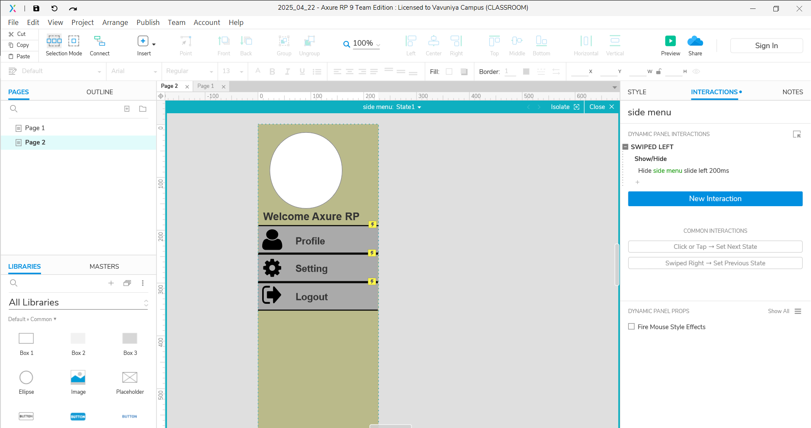

# HCI Gesture Interaction Prototype – Axure RP

This repository contains an interactive prototype developed using **Axure RP** to demonstrate **gesture-based interactions** such as **tap** and **swipe** for Human-Computer Interaction (HCI) scenarios. The prototype features smooth animated transitions, conditional states, and gesture event firing between dynamic panels.

---

## 📌 Project Details

- **Tool Used**: Axure RP 9
- **Prototype Name**: `2025_04_22.rp`
- **Focus**: Mobile-like UI interactions using **tap**, **swipe**, **conditional logic**, and **panel animations**

---

## 📸 Output Preview

### 🖼️ Screenshot

### 🎥 Video Demonstration (Auto-play in supported Markdown viewers)

>  [🎬 click here to watch the video](output.mp4)

---
## 🚀 How to Run the Prototype

1. **Open Axure RP** (v9 or later recommended).
2. Go to `File → Open` and select the file: `2025_04_22.rp`
3. Click **F5** to preview the prototype in your browser.
4. Interact using **tap** and **swipe down** gestures to explore the dynamic panel behaviors.

---

## 📜 License

This prototype is protected under an **All Rights Reserved** license.

> You are **not permitted** to copy, redistribute, or reuse any part of this project without **explicit written permission** from the author.  
> This work is for **educational or internal review purposes only**.

---

## 📬 Contact

For questions, suggestions, or permissions, please contact the project author directly.
